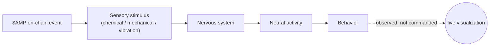
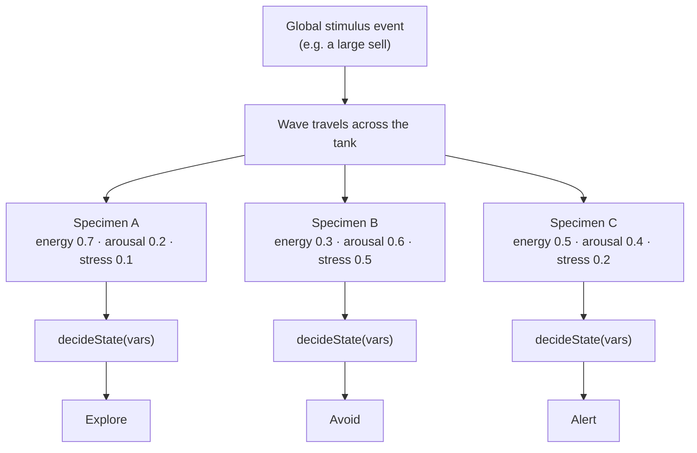

<p align="center">
  
</p>

<h1 align="center">AMPHOOD</h1>

<p align="center">
  <em>The organism never sees the market. It only feels it.</em>
</p>

<p align="center">
  <a href="https://amphood.site/"><strong>amphood</strong></a>
</p>

<p align="center">
  
  
  
  
  
</p>

---

## Table of contents

- [What this is](#what-this-is)
- [The core loop](#the-core-loop)
- [What's actually running](#whats-actually-running)
- [The sensory map](#the-sensory-map)
- [Why amphipods](#why-amphipods)
- [Architecture notes](#architecture-notes)
- [Tech](#tech)
- [Running locally](#running-locally)
- [Project structure](#project-structure)
- [The plan](#the-plan)
- [Disclaimer](#disclaimer)

---

## What this is

AMPHOOD is a living digital organism — an amphipod-inspired creature whose behavior is driven by a simulated nervous system, not a script of pre-recorded animations.

It doesn't know what a buy is. It doesn't know what a sell is. It doesn't know what a candlestick looks like, what a wallet is, or that `$AMP` is a token at all. What it knows is signal: chemical, mechanical, vibrational. Everything that happens around `$AMP` on-chain gets translated into one of those signals *before* it ever reaches the organism — the chain never talks to the creature directly, only to its environment.

Nobody drives this thing. There's no wallet that controls it, no admin key that makes it perform on command, and — deliberately — no LLM deciding what it does next. What every visitor does (buying, selling, showing up, going quiet, even just clicking the tank) changes its environment. What the organism does in response comes out of a small, deterministic nervous-system simulation, not a lookup table of "if buy then approach."

## The core loop



> The market is its environment.
> The blockchain is its sensory system.
> The nervous system is its brain.
>
> You don't control the organism. You disturb its world.

The important part isn't the arrows — it's that **event magnitude sets stimulus intensity, not the resulting behavior**. A large sell guarantees a *stronger* signal, not a *specific* reaction. What happens next depends on the organism's own state at that moment.

## What's actually running

This isn't a hero animation with a paragraph of flavor text bolted on — it's a handful of independent, honest simulations. The most important one is **The colony**, because it's the clearest demonstration of the whole premise:



Same function (`decideState`), same wave, three different outcomes — because each specimen's *own* internal state going in was different. That's not randomness for flavor; it's the entire point of the project.

- **The organism** — rendered from real reference artwork, driven by a burst-and-coast locomotion model: a quick power-stroke flex, a coast on inertia, a rest — the way small swimming crustaceans actually move — instead of a looping animation.
- **Where the organism is right now** — a live scope with one specimen navigating a scent gradient toward a source, a real run/turn/hunch state machine, a hover inspector showing live internal state, a click-to-touch interaction, and a "Listen" button that synthesizes its spikes as audio.
- **The colony** — a shared tank of specimens (see diagram above). Global stimulus events visibly travel across the tank *before* organisms react to them — you can watch the wavefront reach each specimen in turn. The population keeps drifting, exploring, and resting even when nothing is happening on-chain, because idle biology is still biology.
- **The nervous system** — a diagram of the sensory-input → connectome → behavior pipeline, with live (simulated) neural stats: active neurons, sensory pulses, current state.
- **The stimulus scale** — a scatter plot of event intensity vs. simulated sensory response (log scale), deliberately styled like an instrument reading, not a price chart.
- **The plan** — an assembly log, not a roadmap. See [below](#the-plan).

**Honesty note:** there is no `$AMP` contract yet (see the contract bar on the live site), and no shared multiplayer backend behind The colony — each browser tab currently runs its own local simulation. Nothing here fakes a connection to infrastructure that doesn't exist yet. The simulation is architected so a real event source can be swapped in later without touching the logic underneath — see [Architecture notes](#architecture-notes).

## The sensory map

The fixed public mapping between on-chain events and what the organism's nervous system actually receives:

| On-chain event | Sense | Neural input | Organism response |
|---|---|---|---|
| `$AMP` buy | Chemical | Chemosensory pathway | It detects something nearby. |
| `$AMP` large buy | Chemical + intensity | Amplified chemosensory pathway | The signal intensifies. It approaches. |
| `$AMP` sell | Mechanical disturbance | Mechanosensory pathway | Its environment shifts. It recoils. |
| `$AMP` large sell | Strong disturbance | Amplified mechanosensory pathway | A strong disturbance. It retreats. |
| Volume spike | Vibration | Mechanosensory network | The environment becomes active. |
| New holder | Environmental presence | Sensory pathway | Something new enters its world. |
| Market inactivity | Sensory deprivation | Reduced sensory activity | The environment goes quiet. |
| You touch the organism | Touch | Mechanosensory pathway | It flinches. |

## Why amphipods

Amphipods are small, mostly overlooked crustaceans — the things living under wet leaf litter and beach wrack that most people have never consciously looked at. They're a deliberate choice, not just an aesthetic one: real amphipods are built almost entirely around reflex — sense something, react to it — with no room for anything resembling deliberation. That's precisely the model this project simulates: a nervous system that responds to its environment, with nothing "deciding" on top of it.

Their real locomotion is also where the organism's movement model comes from: many small aquatic crustaceans move in bursts — a sharp tail-flick for propulsion, then a coast on inertia while the body relaxes, then a rest — rather than smooth continuous swimming. The organism here does the same thing, on purpose, instead of looping a tween.

## Architecture notes

A few decisions worth knowing if you're reading the code:

- **No game engine, no physics library.** Every animation is hand-written on `<canvas>` (2D context) or SVG, driven by `requestAnimationFrame`. The "physics" is a handful of small pure functions (`decideState`, `applyStimulus`, `naturalTick`), not a simulation framework.
- **Deterministic hashing for hydration safety.** Next.js server-renders first, then hydrates in the browser. Anywhere the UI needs pseudo-randomness that has to match between server and client (or across engines), the code uses an integer-only bit-mixing hash rather than `Math.random()` or `Math.sin()`-based hashing — the latter can differ by a single bit across JS engines, which is enough to break hydration. Where true per-session randomness is fine (specimen IDs, organism spawn positions), it's generated inside `useEffect`, strictly client-side, after mount.
- **The image cutout trick.** The organism artwork has a near-black background. Compositing it cleanly over the site's dark backgrounds needed two different techniques depending on context: `globalCompositeOperation = "lighten"` on `<canvas>`, and an SVG `feColorMatrix` filter (deriving alpha from luminance) inside `<svg>`, since `mix-blend-mode` didn't reliably knock out the background there.
- **State, not scripts.** Nowhere in the codebase does an event type map directly to an animation (no `if (event === "buy") playApproachAnimation()`). Every reaction is the output of `decideState(vars)` acting on internal variables that stimuli merely nudge.

## Tech

- [Next.js](https://nextjs.org) 16 (App Router) + TypeScript
- [Tailwind CSS](https://tailwindcss.com) v4
- Hand-written Canvas 2D / SVG animation — no game engine, no physics library
- Deployed on [Vercel](https://vercel.com)

## Running locally

```bash
npm install
npm run dev
```

Open [http://localhost:3000](http://localhost:3000).

```bash
npm run build   # production build
npm run lint    # eslint
```

## Project structure

```
app/
  page.tsx                       # home page — assembles all sections below
  what-is-this/page.tsx          # long-form explainer
  components/
    Specimen.tsx                 # hero: the organism, live stats, engine status
    HeroBackground.tsx           # ambient grid + starfield behind the hero
    ContractBar.tsx              # $AMP contract address strip
    LiveScope.tsx / LiveScopeSection.tsx   # single-organism live scope
    TheColony.tsx                # shared tank simulation (see above)
    NervousSystemDiagram.tsx / NervousSystemSection.tsx
    ChainToOrganismSection.tsx   # event → sense → response table
    StimulusScaleSection.tsx     # intensity vs. response scatter plot
    ThePlanSection.tsx           # assembly log
    Footer.tsx
```

## The plan

This is an assembly log, not a list of promises — everything marked `DONE` is already part of the live experiment.

| # | System | Status |
|---|---|---|
| 01 | The organism | ✅ Done |
| 02 | The senses | ✅ Done |
| 03 | The nervous system | ✅ Done |
| 04 | The reflexes | ✅ Done |
| 05 | The chain | ✅ Done |
| 06 | The translator | ✅ Done |
| 07 | The live link | 🟡 Building |
| 08 | The observatory | 🟡 Building |

## Disclaimer

AMPHOOD is an independent art project exploring the intersection of biology, simulation, and blockchain. It is not affiliated with any research institution, any blockchain foundation, or any real amphipod. `$AMP` is an experiment in generative art and simulation, not an investment, and nothing here is financial advice.
